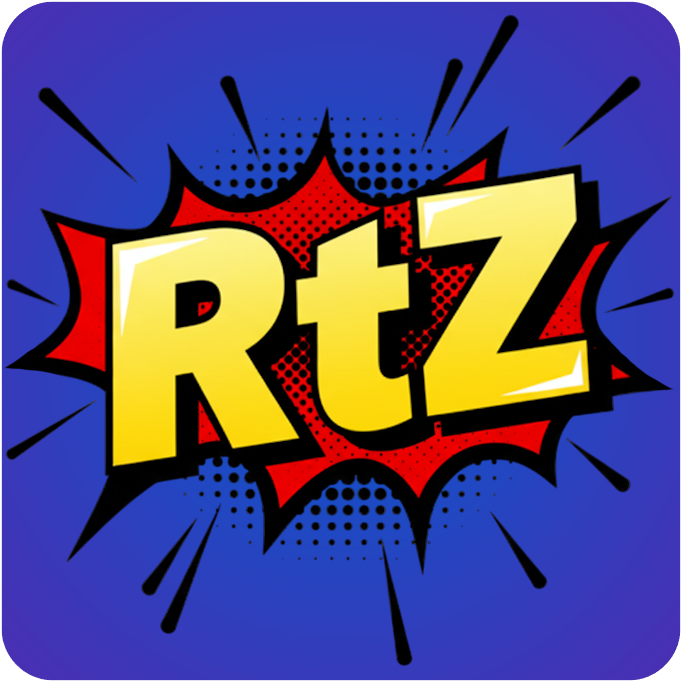

# RtZ Comic Converter

**RtZ Comic Converter** is a Windows console tool that transforms your `.cbr` and `.cbz` files into clean, **uncompressed** `.cbz` archives. Built for collectors who want speed, structure, and a simple workflow.
It works without requiring any dependencies, as it includes the 7z binaries, so you only need to run the .exe.

## Quick Start
1. Run `rtz-comic-converter.exe`.
2. The app creates two folders next to the exe: `CBR` and `CBZ`.
3. Put your `.cbr` files inside the `CBR` folder.
4. Type `start` and press Enter.
5. Converted `.cbz` files appear inside the `CBZ` folder.

## What You Will See
- A progress bar during conversion
- A log file named `conversion.log` in the same folder as the exe
- Failed files are moved to `_failed` inside the output folder

## Distribution Layout
```
dist/
  rtz-comic-converter.exe
  7z/
    7z.exe
    7z.dll
    License.txt
  licenses/
    PROJECT_LICENSE.txt
    THIRD_PARTY_NOTICES.txt
```

## Licenses
- The project license: `licenses/PROJECT_LICENSE.txt`
- Third-party notices: `licenses/THIRD_PARTY_NOTICES.txt`
- 7-Zip license: `7z/License.txt`

## Credits
Program made by animax888.
Repository: https://github.com/animax888/cbr-to-cbz-comic-converter
